# Engramark

<p align="center">
  <picture>
    <source media="(prefers-color-scheme: dark)" srcset="assets/logo-dark.png" />
    <source media="(prefers-color-scheme: light)" srcset="assets/logo-light.png" />
    
  </picture>
</p>

<p align="center">
  <strong>Local long-term memory for coding assistants — thousands of memories, only a few lines of context.</strong>
</p>

<p align="center">
  <a href="README.md">English</a> ·
  <a href="README.zh-CN.md">简体中文</a>
</p>

<p align="center">
  <a href="docs/user-guide.md">User guide</a> ·
  <a href="docs/installation.md">Install and upgrade</a> ·
  <a href="docs/architecture.md">Architecture</a> ·
  <a href="docs/testing.md">Testing</a>
</p>

Engramark gives Codex, OpenCode, and other coding assistants one shared,
local memory. It stores durable knowledge as readable text, builds a
replaceable local search index, and exposes the same memory through MCP and
host integrations. There is no daemon, no LLM dependency for retrieval, no
cloud account, and no telemetry.



## Why Engramark

- **Context stays small.** A request receives at most three short memory hints
  when the local radar finds a match. A miss costs zero context tokens, and
  full details are fetched only when needed.
- **Memory stays under your control.** The readable text cards are the source
  of truth. SQLite is only a derived cache that can be rebuilt at any time.
- **Nothing is recorded implicitly.** Engramark saves only when the user
  clearly asks for long-term retention. Ordinary chat, temporary progress,
  tool output, and command history are not collected.
- **Retrieval can say “not enough evidence.”** Multiple deterministic search
  lanes are fused and scored; weak matches are rejected instead of being
  presented as remembered facts.
- **Writes survive crashes.** Source changes and index updates use recoverable,
  idempotent transactions with cross-process locking and durable replacement.
- **Project memories stay isolated.** A project-scoped memory is visible only
  in its own project. Unreliable project context never silently falls back to
  global storage.

## How it works

1. **You decide what lasts.** Tell the assistant to remember a fact, decision,
   preference, path, or reusable workflow. Engramark does not depend on a fixed
   wake-word list; it interprets the intent of the request.
2. **Relevant memories surface as a short index.** The local radar scans the
   request and injects only compact hints that fit a strict byte budget.
3. **Details are disclosed progressively.** The assistant searches first, then
   retrieves the full text of only the selected memories through MCP.

Candidate memories exist for an explicit “save this as a candidate” workflow.
They remain outside normal search and radar results until the user accepts
them. Important memories can be locked against automatic trust reduction.

## Install

Supported release targets are macOS on Apple Silicon and Intel, Linux x86_64,
and Windows x86_64. Install only artifacts that completed the native CI,
capability probe, and installation-lifecycle job for their platform.

macOS and Linux:

```sh
curl -fsSL https://raw.githubusercontent.com/sunkanwei/engramark/main/install.sh -o /tmp/engramark-install.sh
sh /tmp/engramark-install.sh
```

Windows PowerShell 5.1 or PowerShell 7:

```powershell
$script = Join-Path $env:TEMP "engramark-install.ps1"
Invoke-WebRequest https://raw.githubusercontent.com/sunkanwei/engramark/main/install.ps1 -OutFile $script
& "$env:SystemRoot\System32\WindowsPowerShell\v1.0\powershell.exe" -NoProfile -ExecutionPolicy Bypass -File $script
```

`-ExecutionPolicy Bypass` applies only to that installer process and does not
change the user's saved execution policy. An organization-enforced Group Policy
can still prohibit unsigned scripts; in that case, the device administrator
must allow the installer.

The package contains one native executable with embedded SQLite. Users do not
need Python, Homebrew, a database server, or a package manager. Reinstalling or
upgrading replaces the program but preserves the separate memory directory.

Current public packages are not signed with Apple Developer ID or a Windows
code-signing certificate. Windows may therefore show an “Unknown publisher”
or SmartScreen warning. Download only from this repository's Releases or the
official scripts above; the installer verifies the release checksum and the
per-file package manifest. See [Install and upgrade](docs/installation.md) for
the trust model, paths, upgrades, and uninstall behavior.

## Start using it

After restarting the detected host, speak naturally:

- “Remember that this project targets API 24.”
- “From now on, use pnpm in this repository.”
- “What do you remember about the release checklist?”
- “Save this as a candidate; I want to review it later.”
- “Archive memory 18.”

Saving and curation happen through the installed MCP tools. Search returns a
small human-readable result set; the assistant retrieves full details by
memory ID only when they are relevant. Changes made through MCP or the CLI are
immediately visible to new searches without restarting the host.

## Measured baseline

These are project-owned regression results, not results from a public memory
benchmark such as LOCOMO:

| Metric | Result |
|---|---:|
| Synthetic long-term collection | 2,000 cards |
| Full index rebuild | about 0.5 s |
| Hot query p95 | about 7 ms |
| Golden recall@5 | 1.0 |
| Unrelated-query rejection | 1.0 |
| False radar injections | 0 |
| Project isolation | passed |
| Per-request radar output | at most 3 short hints |

The reproducible procedure and the larger 10,006-card release check are
documented in [Testing and validation](docs/testing.md).

## Privacy and reliability

- Program files live separately from private memory data, so reinstalling does
  not overwrite memories and uninstalling does not delete them.
- On Unix, private directories use `0700` and private files use `0600`.
  Windows uses a protected ACL for the current user, SYSTEM, and Administrators.
- Explicit search reports cache failures, lock timeouts, and time-budget
  failures instead of disguising them as an empty result.
- Automatic hooks fail open: if memory is unavailable, the host request
  continues without injected context.
- Consistent backups copy the text source and durable ID state, not a live
  SQLite file. Rollback first creates a safety snapshot and never lowers the ID
  high-water mark.
- Real cards, persistent state, caches, logs, and local runtime files are
  excluded from Git and protected by repository privacy tests.

## Configuration

User configuration lives at `~/engramark/engramark.json`. Common controls:

| Setting | Default | Purpose |
|---|---:|---|
| `radar.budget` | `3` | Maximum short hints injected for one request |
| `radar.cooldown_ttl_seconds` | `86400` | Per-session, per-memory cooldown |
| `opencode.request_radar_enabled` | `false` | Enable the verified OpenCode request radar |
| `search.query_timeout_ms` | `500` | Search time budget |
| `search.high_threshold` / `medium_threshold` | `0.64` / `0.34` | Confidence and rejection thresholds |
| `search.preview_max_bytes` | `800` | Preview cap for the top high-confidence result |

OpenCode request radar is intentionally disabled by default because its short
index is stored in the user message's `system` field and can be seen by the
main model, title generation, or compaction. The currently verified OpenCode
App version is 1.18.11. MCP search remains available when radar is disabled.

## Documentation

For users:

- [User guide](docs/user-guide.md) — daily memory operations, scope, backup,
  recovery, privacy, and host behavior.
- [Install and upgrade](docs/installation.md) — supported systems, verified
  installation, upgrades, paths, and uninstall.

For maintainers and contributors:

- [Architecture](docs/architecture.md) — invariants, storage, search, locking,
  recovery, MCP, and host adapters.
- [Testing and validation](docs/testing.md) — golden contracts, black-box
  suites, scale checks, and native CI.
- [Maintainer release guide](docs/release-guide.md) — build, supply-chain
  checks, release candidates, and GitHub Releases.
- [Third-party notices](THIRD_PARTY_NOTICES.md) — dependency and Unicode
  licensing.

## Current boundaries

- The data directory is supported only on a local filesystem. NFS, SMB,
  synchronized cloud folders, and removable media are outside the consistency
  guarantee.
- OpenCode request radar is disabled by default and version-gated; MCP remains
  the stable integration path.
- Retrieval is deterministic and lexical today. Semantic retrieval is on the
  roadmap.
- Release artifacts include an SBOM, upstream licenses, checksums, per-file
  manifests, and GitHub build provenance, but current public packages are not
  platform-signed.
- English documentation is available, while most v0.1 runtime messages and
  MCP-facing descriptions remain Chinese.

Engramark is licensed under the [MIT License](LICENSE).
