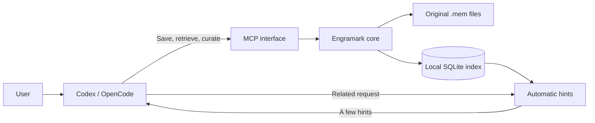
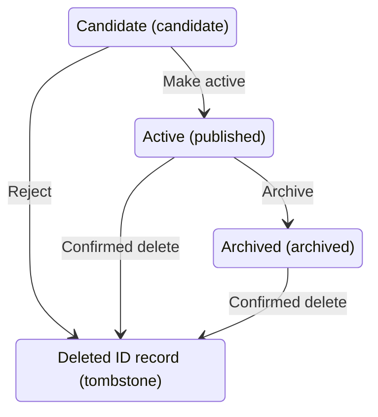

# Architecture

**[English](architecture.md) | [简体中文](架构设计.md)**

This document is for maintainers and contributors who need the implementation boundaries. It records constraints implemented by the current codebase, not a wishlist. See the [User Guide](user-guide.md) for daily use and [Testing and Validation](testing.md) for gates and measurements.

## 1. Overview

Engramark is a local, on-demand long-term memory layer with no daemon. Codex and OpenCode share one text memory source and one rebuildable local index.



On a save, the core updates the original memory and synchronizes the local index. On retrieval, the index narrows the candidates quickly and full content is read only when needed. SQLite can be deleted and rebuilt; text memories and durable state cannot be treated as cache.

The current release matrix covers macOS arm64/x86_64, Linux x86_64, and Windows x86_64. See [Supported platforms](installation.md#supported-platforms) for native validation environments. The data directory is supported only on a local filesystem. NFS, SMB, synchronized cloud folders, and removable media are outside the consistency guarantee.

## 2. Design promises

| Promise | Implementation meaning |
|---|---|
| Original memories stay readable | `.mem` is the only source of memory content; SQLite is a local index |
| The user decides what is saved | A write requires explicit long-term retention intent; ordinary sessions are not collected |
| Projects remain isolated | Project memories are filtered before recall and cannot be read or changed elsewhere |
| IDs are never reused | Deleted content leaves an ID record so an old reference cannot point to new content |
| A successful write is immediately visible | After the write returns success, a new query must observe the new value |
| Failures are explicit where they matter | Direct retrieval reports errors; automatic hints never block the original request |
| Indexes follow runtime capabilities | A version or capability change affecting recall, filtering, or ranking invalidates the old index |
| Long-term behavior uses durable state | IDs, transactions, and access dates persist; diagnostic counters and session cooldown may be disposable |

Automatic integrations retrieve accepted memories only. They do not record sessions or create candidates.

## 3. Data and directories

Private data layout:

```text
cards/                         original memory files
state/id-sequence              ID high-water mark
state/transactions/*.txn       recovery evidence for incomplete writes
state/locks/                   cross-process coordination
cache/memory.mcache            rebuildable SQLite index (v7)
engramark.json                 user configuration
```

Platform paths:

| System | Program directory | Private data directory |
|---|---|---|
| macOS and Linux | `~/.local/share/engramark/` | `~/engramark/` |
| Windows | `%LOCALAPPDATA%\Engramark\` | `%USERPROFILE%\engramark\` |

`state/` is durable and cannot be deleted like `cache/`. `last-used` influences freshness and ranking, with the memory file as authority. The first explicit detail read of an active memory on a given day writes back at most once. Search summaries, previews, and automatic hints remain read-only: content a model may have seen is not treated as an explicit read. The current version does not count accesses, avoiding a write transaction on every read.

## 4. Memory files and states

`.mem v1` is Engramark's own readable text format, not a general interchange standard.

- It uses UTF-8 without BOM and LF endings; the reader accepts complete CRLF files.
- Body blank lines, trailing spaces, and Unicode are preserved.
- Only defined directives are accepted before the title.
- Entities are deduplicated by normalized key; entity order has no meaning.
- Trust is stored as fixed-point integers from 0 through 6 and displayed as half-steps from T0 through T3.
- Semantic hashing uses a versioned canonical encoding with field numbers, types, and length boundaries.
- `F` is a derived display value outside the semantic hash; the source file also has a byte-level SHA-256.
- A format upgrade must be an explicit migration that first saves the original files and a unified diff.



Every state remains under `cards/`. Activation, rejection, update, archive, and delete atomically replace the same file. Feedback writes the memory file and `state/feedback/<id>.mark` in one recoverable transaction so a crash cannot score the same memory twice in one day.

Exact duplicates reuse the existing ID. A known replacement uses `# supersedes @old-id`; every referenced ID must exist and replacement relationships cannot form a cycle.

## 5. MCP boundary and project isolation

MCP never accepts a complete `.mem` document. Save and candidate operations use `title`, `body`, `entities`, `type`, and `scope`; locking belongs only to an active save. The core validates fields, constructs the memory object, and serializes the text format. Active saves default to `I3/T3`, candidates to `I2/T2`, and public types are `fact`, `decision`, and `skill`. An assistant may create a candidate only after the user explicitly asks for one.

Updates use field-level PATCH semantics: an absent field is preserved, while an empty body or entity array explicitly clears it. Only title, body, entities, and type may change. The core preserves ID, state, source, lock, scope, importance, trust, access date, validity, and replacement relationships. A no-op update does not write the original file, commit a transaction, or increment the index generation.

MCP retrieval accepts one non-empty natural-language `query`, searches active memories only, and returns at most five items. Pagination, state ranges, project parameters, and score explanations remain CLI-only. The top final high-confidence result may include a body preview of at most 800 UTF-8 bytes; other results use summaries capped at 160 Unicode code points. SessionStart `top --human` always uses short summaries. Conversation output uses natural-language “memory ID + title” lines rather than card headers, `I/T/F`, raw JSON, or internal exceptions.

Scope is an isolation boundary:

- with a known project, only global memories and memories from that project are visible;
- without a known project, only global memories are visible;
- search, automatic hints, reads by ID, feedback, updates, and lifecycle operations share the same visibility check;
- after a project memory is rejected or deleted, its ID record keeps a path-free scope identifier so it cannot become visible across projects.

Project context is resolved, in order, from the unique file root in MCP `roots`, a process working directory with a project marker, or a managed `mcp_servers.engramark.cwd` entry in trusted Codex project configuration. The filesystem root, user home, common broad directories, system temporary directory, program directory, and memory data directory are not projects. If context is unknown, a project save fails and never silently becomes global.

The server explicitly negotiates MCP `2025-06-18` and `2025-11-25`. An unknown version receives the latest supported server version rather than a blind echo. Tools use strict JSON Schema and accurate side-effect annotations. Input and business errors are self-correctable tool errors; unknown tools and protocol failures use JSON-RPC errors. Transport logs record request metadata and byte counts, never the query, title, body, entities, feedback reason, or full result.

## 6. Writes, concurrency, and recovery

Concurrency rules:

- a query holds shared `cache.swap.lock` from database open through close;
- a mutation acquires exclusive `mutation.lock` before exclusive `cache.swap.lock`;
- lock order is fixed and every lock has a timeout;
- each MCP call opens SQLite briefly, with no long-lived connection;
- a full rebuild creates the database in a private temporary directory on the same filesystem and takes the exclusive swap lock only for final replacement.

Cross-process coordination uses Rust standard-library file locking: `flock` on Unix and `LockFileEx` on Windows. Lock files reject symbolic links and Windows reparse points, and timeout values are bounded.

Temporary files are created privately next to the target, written and synced, atomically replaced, and followed by a parent-directory sync. macOS adds `F_FULLFSYNC`; Windows uses protected DACLs, `MoveFileExW`, and `FlushFileBuffers`. SQLite is fixed to `journal_mode=DELETE`, `synchronous=FULL`, `foreign_keys=ON`, `trusted_schema=OFF`, and `mmap_size=0`; macOS also enables `fullfsync`.

These measures and fault injection demonstrate process-crash recovery. They are not an end-to-end power-loss certification for every hardware and filesystem combination.

Every mutation:

1. parses and validates the complete post-change memory graph;
2. acquires both exclusive locks in the fixed order;
3. writes a self-checking transaction journal with UUID, before and after hashes, and a recovery payload;
4. atomically replaces `.mem` and syncs the file and parent directory;
5. updates ordinary tables, both FTS indexes, automatic-hint data, index generation, and `applied_ops` in one SQLite transaction;
6. uses the SQLite commit as the point at which the API write succeeds;
7. deletes the journal and syncs its parent directory.

Recovery matrix:

| Original file | Local index | Action |
|---|---|---|
| Old | Old | Operation never started; remove the journal |
| New | Old | Replay the index from the original file |
| New | New | Operation completed; remove the journal |
| Old | New | Repair the index to match the original file and report it |
| Other | Any | Stop automatic recovery and preserve evidence |

A multi-file transaction recovers against the complete state vector. A partial state is completed from the hash-verified payload. UUIDs and `applied_ops` make replay idempotent.

## 7. Single executable and local index

Codex, OpenCode, hooks, MCP, and CLI all invoke `bin/engramark` from the current release. Public archives contain a Rust executable built with the pinned toolchain and embedded SQLite. They do not use the user's Python installation, perform runtime downloads, or rebind a runtime.

Installation runs the executable capability self-check before safely switching the program directory and retaining one rollback version, then migrates memories and rebuilds the index. A failure restores the previous program and integration. Host configuration is preflighted before any edit.

Index v7 records one complete capability fingerprint:

- memory format and index schema versions;
- schema, query-planner, normalization, tokenizer, and automatic-hint compiler versions;
- exact SQLite version, compile-option summary, and probe results for STRICT, FTS5, trigram, contentless-delete, and contentless-unindexed;
- Unicode data version, complete original-file-set hash, build UUID, generation, effective date, and completion marker.

When the fingerprint is stale, Engramark rebuilds the index from memory files. An index is not portable across machines. The portable boundary is `.mem` or a controlled snapshot, from which the destination builds its own index.

Ordinary tables use STRICT mode, separate integer columns, and constraints. The Unicode FTS index stores complete titles and bodies. The trigram index stores titles, entities, anchors, URLs, paths, and code identifiers without copying the entire long body.

Default limits:

- 2 MiB per memory;
- 4,096 characters per query;
- candidate pool of 80;
- 500 ms query budget;
- at most five detail memories per call and 2,000 bytes returned per memory.

An explicit query fails on timeout or index unavailability rather than returning a fabricated empty result. Full diagnosis compares the effective memory set, ordinary table, both FTS indexes, semantic hashes, and FTS internal integrity.

## 8. Automatic hints and host adapters

Automatic-hint data is stored as a self-checking, sectioned bytecode BLOB in SQLite. It records a magic value, format, compiler and normalization versions, state and edge counts, section lengths, and SHA-256. An unknown required section invalidates the object; only unknown optional sections can be skipped.

- A Codex hook can scan the index while the user submits input and inject short natural-language hints.
- OpenCode installs a minimal request plugin that is disabled by default. When enabled, it still reads active memories only and never records sessions, tools, commands, or candidates.
- OpenCode automatic hints are validated only against App 1.18.11. The plugin waits for the durable `message.updated` event before committing cooldown. If the message is not stored or another plugin rewrites the block, the short reservation is cancelled or expires.
- An OpenCode hint is stored in the user message's `system` field. The request text itself does not enter Engramark. Local state stores only a session hash and IDs actually reserved or shown.
- Both hosts share the same executable, memory files, and local index.

The core caps each hint line at 360 Unicode code points and 900 UTF-8 bytes, with an optional first-paragraph gist of at most 120 code points. The complete injected block is capped at 1,200 UTF-8 bytes. Host adapters wrap, validate, and pass through this output without resummarizing or truncating it. Cooldown applies per memory only after actual display; memories outside the byte budget and other memories sharing an anchor are not cooled down with it.

Automatic integration catches failures and continues the original request. Explicit MCP calls return visible errors. This difference is intentional failure semantics.

## 9. Security, backup, and release packages

- Unix private directories use `0700` and memory, state, and index files use `0600`. Windows uses a protected DACL allowing only the current user, SYSTEM, and Administrators.
- The index contains full memory content. At-rest protection still depends on system disk encryption such as FileVault or BitLocker.
- Release archives reject absolute and traversal paths, links, special files, case-folding collisions, and oversized contents. After extraction, `MANIFEST.tsv` verifies the allowlist, size, and SHA-256 of every file.
- `checksums.txt` detects transport corruption but is not publisher identity by itself. GitHub build provenance shows that artifacts came from the repository workflow, but it is not platform code signing.
- A consistent backup first recovers pending transactions, holds the mutation lock, and copies only memory files, ID state, and a manifest—not a live SQLite database.
- Rollback first saves the current state and never lowers the ID high-water mark.
- Git excludes real memories, state, indexes, logs, locks, local runtimes, and installation records. The retired `raw/` directory remains ignored.

Automated tests protect the repository privacy boundary, but `git add -f` must never bypass the ignore rules.

## 10. Glossary

| Term | Meaning |
|---|---|
| Original memory / `.mem` | Readable, backup-worthy long-term data that must not be treated as cache |
| Local index / SQLite | Data generated for fast retrieval and rebuildable from original memories |
| Active memory / `published` | A memory participating in daily retrieval and automatic hints |
| Candidate / `candidate` | Content waiting for user confirmation and excluded from daily retrieval |
| Deleted ID record / `tombstone` | Cleared content whose ID remains reserved and is never reused |
| Automatic hint | A small relevant hint retrieved from the local index while a coding-assistant request is submitted |
| Fail without blocking | A memory failure does not stop the original Codex/OpenCode request |
| Capability fingerprint | Versions and runtime capabilities that determine whether an old index is safe to reuse |
