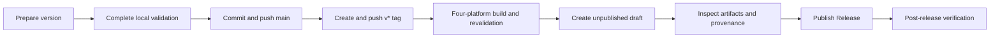

# Maintainer Release Guide

**[English](release-guide.md) | [简体中文](发布指南.md)**

This guide is for maintainers. It explains when Engramark needs a new release and how to build, validate, and publish it. Users should follow [Install and Upgrade](installation.md); complete test commands live in [Testing and Validation](testing.md).

## Distinguish four actions first

| Action | Meaning | Creates a public version |
|---|---|---:|
| Git commit | Records a group of changes locally | No |
| Branch push | Synchronizes commits to the remote repository | No |
| Version-tag push | Starts the four-platform release workflow | Draft only |
| Publish GitHub Release | Makes release notes and downloads public | Yes |

An ordinary commit is not a release. Users see a new downloadable version only after the version number, tag, automated validation, and public Release all complete.

## Decide whether a release is needed

| Change | Usual treatment |
|---|---|
| Comments, internal refactoring, developer docs, or wording with no user impact | No release |
| A user-facing defect, security issue, compatibility issue, or data-reliability fix | Patch release |
| A published installation instruction error that can cause installation or use to fail | Patch release |
| A backward-compatible user feature or platform | Minor release |
| An incompatible public behavior change | Major release |

Versions follow semantic-versioning principles. Do not create an empty release merely to produce a new version number.

Before release work starts, explain the proposed version, reason, and user-visible changes to the project owner. Do not push a version tag or publish a Release without explicit authorization.

## Release model and targets

Engramark builds one native executable for each platform:

| Target argument | Platform | Archive |
|---|---|---|
| `macos-arm64` | macOS Apple Silicon | `.tar.gz` |
| `macos-x86_64` | macOS Intel | `.tar.gz` |
| `linux-x86_64` | Linux x86_64 | `.tar.gz` |
| `windows-x86_64` | Windows x86_64 | `.zip` |

Each platform must build and execute on its own native runner. Cross-compilation cannot replace the capability self-check, full test suite, and installation lifecycle.

A release archive contains replaceable program files, Codex/OpenCode adapters, default configuration, documentation, licenses, and supply-chain metadata. It never contains real memories, a local index, or durable user state.

## Release flow



## 1. Prepare the version

Before release, confirm:

- [ ] root `VERSION` and `rust/Cargo.toml` versions match;
- [ ] the target tag is `v<version>`;
- [ ] the worktree contains only expected changes and no real memories, credentials, or local artifacts;
- [ ] user-visible behavior, supported boundaries, and both documentation languages are synchronized;
- [ ] golden-contract changes received explicit review and coordinated implementation, manifest, and documentation updates;
- [ ] the proposed version and release reason are authorized.

## 2. Build and validate locally

Build only a target that the current machine can run natively:

```sh
python3 packaging/build_release.py --target <current-native-target>
```

The builder performs a locked release build and capability self-check, then produces:

```text
dist/engramark-<version>-<target>.tar.gz
dist/engramark-<version>-windows-x86_64.zip
dist/checksums.txt
```

Each candidate contains:

- the native `engramark` or `engramark.exe` executable;
- default configuration, host adapters, and English and Chinese documentation;
- `SBOM.json`;
- upstream licenses for Rust dependencies and Unicode data;
- `MANIFEST.tsv` with the type, size, and SHA-256 of every file.

Before release, run at least:

```sh
python3 tests/run.py
python3 tests/test_repository_privacy.py
python3 tests/test_documentation.py
ENGRAMARK_SCALE_CARDS=10006 python3 tests/test_retrieval_scale.py
python3 packaging/build_release.py --target <current-native-target>
python3 tests/test_install_lifecycle.py
```

See the [complete local gate](testing.md#complete-local-gate) for formatting, static, and supply-chain checks.

The lifecycle uses an isolated user directory to verify malicious-archive rejection, installation, host integration, retrieval, writes, backup, upgrade reinstall, uninstall, and preservation of memory data after uninstall.

Linux artifacts are built on Ubuntu 22.04 and reject symbol requirements above glibc 2.35. macOS artifacts declare a 13.0 deployment target; that declaration is not evidence of native execution on a particular macOS version.

## 3. Push the version tag

Only after the target commit, required tests, and main-branch CI pass—and release authorization exists—create the tag matching `VERSION`:

```sh
version=$(cat VERSION)
git tag -a "v$version" -m "Engramark v$version"
git push origin "v$version"
```

Do not rewrite a public tag or replace proven release assets in place. When a public version has a problem, keep it and create a new patch version.

## 4. Wait for the GitHub release candidate

The tag starts GitHub Actions, which:

1. runs static, documentation, privacy, and supply-chain gates;
2. runs the full suite, capability self-check, package build, and installation lifecycle on four native runners;
3. revalidates the same candidate archives on newer systems;
4. produces a unified `checksums.txt`;
5. generates GitHub build provenance for the artifacts;
6. creates an unpublished GitHub Release draft.

Automation does not publish the version. A transient runner or network failure may be rerun. If a fix changes candidate content, do not move the original tag; increment the version and create a new tag. Never skip a failed job or describe the draft as published.

## 5. Inspect and publish the draft

Before publication, confirm:

- [ ] all four platform builds passed;
- [ ] all four compatibility revalidations passed;
- [ ] the Release contains four native artifacts and one unified `checksums.txt`;
- [ ] GitHub build provenance is visible;
- [ ] filenames, tag, `VERSION`, and Cargo package version match;
- [ ] release notes accurately summarize user-visible changes;
- [ ] unsigned-package and system-warning boundaries remain explicit.

Current distribution uses three integrity layers:

- outer `checksums.txt` for downloaded artifacts;
- inner `MANIFEST.tsv` for every extracted file;
- GitHub build provenance showing that artifacts came from this repository's workflow.

These measures are not operating-system code signing. Current public packages do not have Apple Developer ID signing, notarization, or a Windows code-signing certificate, so users may still see source or unknown-publisher warnings. Until platform signing is actually implemented, checksums and provenance must not be described as code signing.

## 6. Verify after release

After publication, confirm:

- [ ] the latest-version page provides four correct platform archives and the unified checksum file;
- [ ] installers parse artifact names and select the current platform;
- [ ] GitHub build provenance is publicly accessible;
- [ ] README and installation-guide commands remain valid;
- [ ] the new version is marked Latest;
- [ ] no release fix remains only on `main`.

Engramark itself uses the MIT License. Every candidate must also carry the dependency SBOM and collected upstream licenses.
