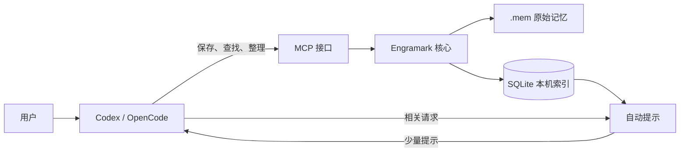
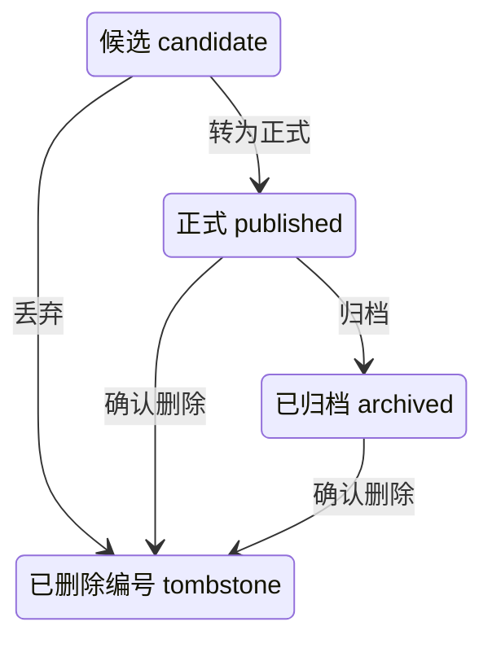

# 架构设计

**[English](architecture.md) | [简体中文](架构设计.md)**

本文面向维护者和希望理解实现边界的贡献者，记录当前代码已经实现的架构约束，不是未来功能愿望清单。普通使用方法见[使用指南](使用指南.md)，测试门槛与实测方法见[测试与验收](测试与验收.md)。

## 1. 总览

Engramark 是本地、按需启动的长期记忆层，没有常驻服务。Codex 与 OpenCode 共用一份文本记忆和一个可重新生成的本机索引。



保存时，核心先更新原始记忆，再同步本机索引；查找时，索引负责快速筛选，确有需要才读取完整记忆。SQLite 可以删除后重建，文本记忆和持久状态不能当作缓存删除。

当前发布矩阵包括 macOS arm64/x86_64、Linux x86_64 和 Windows x86_64，具体原生验证环境见[安装指南](安装指南.md#支持的平台)。数据目录只支持本地文件系统；NFS、SMB、云盘同步目录和可移动介质不在一致性承诺内。

## 2. 设计承诺

| 承诺 | 实现含义 |
|---|---|
| 原始记忆可读 | `.mem` 是记忆内容的唯一原始数据，SQLite 只是本机索引 |
| 用户决定是否保存 | 只有用户明确表达长期保存意图时才写入，普通会话不会被采集 |
| 项目严格隔离 | 项目记忆在召回前就被过滤，不会从其他项目读取或修改 |
| 编号永不复用 | 删除内容后保留编号记录，避免旧引用指向新内容 |
| 成功写入立即可见 | 写入返回成功后，新查询必须看到新值 |
| 故障语义明确 | 主动查找失败会报错；自动提示失败不会阻断原请求 |
| 索引随能力变化重建 | 影响召回、过滤或排序的版本和能力变化会使旧索引失效 |
| 长期行为依赖持久状态 | 编号、事务和使用时间等持久化；诊断计数和会话冷却可以丢失 |

自动接入只读取已有正式记忆，不记录会话，也不会自行创建候选。

## 3. 数据与目录

私人数据目录结构：

```text
cards/                         原始记忆文件
state/id-sequence              编号高水位
state/transactions/*.txn       未完成事务的恢复证据
state/locks/                   跨进程协调
cache/memory.mcache            可重新生成的 SQLite 索引（v7）
engramark.json                 用户配置
```

平台路径：

| 系统 | 程序目录 | 私人数据目录 |
|---|---|---|
| macOS、Linux | `~/.local/share/engramark/` | `~/engramark/` |
| Windows | `%LOCALAPPDATA%\Engramark\` | `%USERPROFILE%\engramark\` |

`state/` 是持久数据，不能像 `cache/` 一样删除。`last-used` 影响新鲜度和排序，以记忆文件为准；每张正式记忆每天第一次被明确读取详情时最多回写一次。搜索摘要、预览和自动提示保持只读，不把模型可能看到的内容等同于明确读取。当前版本不采集访问次数，避免每次读取都产生写事务。

## 4. 记忆文件与状态

`.mem v1` 是 Engramark 自有的可读文本格式，不是通用交换格式。

- 使用 UTF-8、无 BOM 和 LF；读取时兼容完整 CRLF；
- 正文保留空行、行尾空格和 Unicode；
- 标题之前只接受已定义指令，未知指令会被拒绝；
- 实体按规范化键去重，实体顺序没有语义；
- 可信度内部使用 0–6 的整数固定点，对外显示为 T0–T3 的半档；
- 语义哈希使用带格式版本、字段编号、类型和长度边界的规范编码；
- `F` 是派生展示值，不进入语义哈希，源文件另有逐字节 SHA-256；
- 格式升级必须显式迁移，并先保存原文件备份和统一差异。



所有状态都保留在 `cards/`。转为正式、丢弃、修改、归档和删除都原子替换同一文件。反馈把记忆文件与 `state/feedback/<编号>.mark` 放入同一可恢复事务，避免崩溃后同一天重复计分。

完全重复的内容复用原编号；确定替代关系使用 `# supersedes @旧编号`，被引用编号必须存在且关系不得成环。

## 5. MCP 边界与项目隔离

MCP 不接收完整 `.mem` 文档。保存和候选操作使用 `title、body、entities、type、scope`，锁定只属于正式保存。核心统一校验字段、建立记忆对象并序列化文本格式。正式保存默认 `I3/T3`，候选默认 `I2/T2`；公开类型为 `fact、decision、skill`。AI 只有在用户明确要求“先存为候选”时才能创建候选。

更新采用字段级 PATCH：字段缺席表示保留，空正文和空实体数组表示明确清空。只能修改标题、正文、实体和类型；编号、状态、来源、锁定、作用范围、重要度、可信度、访问时间、有效期和替代关系由核心保留。内容没有变化时不写原文件、不提交事务，也不增加索引代次。

MCP 查找只接收一个非空自然语言 `query`，固定查找正式记忆并最多返回 5 条。分页、状态范围、项目参数和评分解释只在 CLI 中提供。最终高置信度第一名可包含最多 800 UTF-8 字节正文预览，其他结果保留最多 160 个 Unicode 码点的短摘要。SessionStart 的 `top --human` 始终使用短摘要。对话输出使用“记忆编号 + 标题”的自然语言形式，不暴露 `.mem` 卡头、`I/T/F`、原始 JSON 或内部异常。

作用范围是隔离边界：

- 项目已知时，只允许访问全局记忆和当前项目记忆；
- 项目未知时，只允许访问全局记忆；
- 查找、自动提示、按编号读取、反馈、更新和生命周期操作使用同一套可见性判断；
- 项目记忆被丢弃或删除后，编号记录仍保留不含路径的范围标识，避免跨项目变得可见。

项目上下文按顺序来自 MCP `roots` 的唯一文件根、带项目标记的进程工作目录，或 Codex 受信任项目配置中的 `mcp_servers.engramark.cwd`。根目录、用户主目录、常用宽泛目录、系统临时目录、程序目录和记忆数据目录都不构成项目。上下文未知时，项目写入明确失败，绝不静默降级为全局记忆。

服务明确协商 MCP `2025-06-18` 与 `2025-11-25`。未知版本返回服务端最高支持版本，不盲目回显。工具使用严格 JSON Schema 和真实副作用注解；输入或业务错误以可自纠工具错误返回，未知工具和协议故障使用 JSON-RPC 错误。传输日志只记录请求元数据与字节数，不记录查询、标题、正文、实体、反馈理由或完整结果。

## 6. 写入、并发与恢复

并发规则：

- 查询持有共享 `cache.swap.lock`，覆盖打开、查询和关闭全过程；
- 变更先独占 `mutation.lock`，再独占 `cache.swap.lock`；
- 锁顺序固定，所有锁都有超时；
- MCP 每次调用短暂打开 SQLite，不保留长期连接；
- 全量重建在同一文件系统的私有临时目录中建库，最终切换时才独占交换锁。

跨进程协调使用 Rust 标准库文件锁：Unix 对应 `flock`，Windows 对应 `LockFileEx`。锁文件拒绝符号链接与 Windows 重解析点，超时值只接受有限范围。

临时文件在目标同目录以私有权限创建，写入并同步后原子替换，再同步父目录。macOS 额外使用 `F_FULLFSYNC`；Windows 使用受保护 DACL、`MoveFileExW` 和 `FlushFileBuffers`。SQLite 固定使用 `journal_mode=DELETE`、`synchronous=FULL`、`foreign_keys=ON`、`trusted_schema=OFF`、`mmap_size=0`，macOS 额外启用 `fullfsync`。

这些措施与故障注入证明进程崩溃后的恢复能力；在具体硬件和文件系统上完成断电试验前，不宣称端到端断电认证。

每次变更：

1. 解析并验证变更后的完整记忆图；
2. 按固定顺序获取两个独占锁；
3. 写入包含 UUID、自校验、前后哈希和恢复载荷的事务日志；
4. 原子替换 `.mem` 并同步文件与父目录；
5. 在一个 SQLite 事务中同步普通表、两个 FTS、自动提示索引、索引代次和 `applied_ops`；
6. 以 SQLite 提交作为 API 写入成功的时间点；
7. 删除事务日志并同步父目录。

恢复矩阵：

| 原始文件 | 本机索引 | 处理 |
|---|---|---|
| 旧 | 旧 | 操作未开始，清理日志 |
| 新 | 旧 | 从原始文件重放索引 |
| 新 | 新 | 操作已完成，清理日志 |
| 旧 | 新 | 以原始文件修复索引并报告 |
| 其他 | 任意 | 停止自动恢复并保留证据 |

多文件事务按完整状态向量恢复；半完成状态使用日志内经哈希验证的载荷补齐。UUID 与 `applied_ops` 保证重放幂等。

## 7. 单二进制与本机索引

Codex、OpenCode、钩子、MCP 和 CLI 全部调用当前发布版本中的单一原生二进制 `bin/engramark`。公开安装包使用锁定工具链构建 Rust 程序并内嵌 SQLite，不使用用户电脑里的 Python，不进行运行时下载或运行时重绑定。

安装时先运行二进制能力自检，再安全切换程序目录并保留一个回退版本，然后迁移记忆并重建索引。任何一步失败都会恢复旧程序与旧接入；宿主配置在写入前完成预检。

索引 v7 的元数据只保存一次完整能力指纹：

- `.mem` 格式版本和索引结构版本；
- 表结构、查询规划器、规范化、分词器和自动提示编译器版本；
- SQLite 精确版本、编译选项摘要和 STRICT、FTS5、trigram、contentless-delete、contentless-unindexed 能力探针结果；
- Unicode 数据版本、完整原始文件集合哈希、构建 UUID、代次、有效日期和完成标志。

能力指纹过期时，Engramark 从记忆文件自动重建索引。索引不可跨机器复制使用；可移植边界是 `.mem` 文件或受控快照，目标安装据此建立自己的索引。

普通表使用 STRICT、独立整数列和约束。Unicode FTS 索引完整标题和正文；trigram 索引标题、实体、锚点、网址、路径和代码标识符，不复制整篇长正文。

默认边界：

- 单条记忆最大 2 MiB；
- 查询最大 4,096 字符；
- 候选池 80；
- 单次查询预算 500 ms；
- 单次详情最多 5 条，每条最多返回 2,000 字节。

查询超时或索引不可用时，主动查找会失败，不会返回伪造的空结果。完整诊断会核对有效记忆集合、普通表、两个 FTS、语义哈希和 FTS 自身完整性。

## 8. 自动提示与宿主适配

自动提示索引以 SQLite BLOB 保存自校验分区字节码，包含魔数、格式版本、编译器版本、规范化版本、状态数、边数、区段长度和 SHA-256。未知必需区段会使整个对象失效；未知可选区段才允许跳过。

- Codex 钩子可以在用户输入阶段扫描索引并注入简短的自然语言提示；
- OpenCode 安装一个默认关闭的最小请求插件，开启后也只读取已有正式记忆，不记录会话、工具或命令，不创建候选；
- OpenCode 自动提示当前只验收 App 1.18.11，通过耐久 `message.updated` 事件确认提示确已保存后才提交冷却；消息未保存或被其他插件改写时，短期保留会取消或过期；
- OpenCode 提示随该条用户消息的 `system` 字段保存，请求正文不进入 Engramark；本机状态只保存会话哈希和实际预留或展示的记忆编号；
- 两个宿主共享同一二进制、记忆文件和本机索引。

核心生成的每行提示最多 360 个 Unicode 码点和 900 UTF-8 字节，可包含最多 120 个码点的首段摘要；完整注入块最多 1,200 UTF-8 字节。宿主适配器只包装、校验和透传，不重新摘要或截断。冷却按记忆隔离，只有实际展示后才生效；预算外记忆和共享同一锚点的其他记忆不会被连带冷却。

自动接入捕获异常并继续原请求；显式 MCP 调用返回可见错误。这是刻意设计的故障语义差异。

## 9. 安全、备份与发布包

- Unix 私有目录权限为 `0700`，记忆、状态和索引文件为 `0600`；Windows 使用只授权当前用户、SYSTEM 和 Administrators 的受保护 DACL；
- 索引包含完整记忆，静态保护仍依赖 FileVault、BitLocker 等系统磁盘加密；
- 发布包拒绝绝对路径、上跳路径、链接、特殊文件、大小写折叠冲突和超量内容，展开后按 `MANIFEST.tsv` 复验白名单、大小和逐文件 SHA-256；
- `checksums.txt` 用于发现传输损坏，不单独作为发布者身份证明；GitHub 构建来源证明确认产物来自仓库工作流，但不等同于平台代码签名；
- 一致备份先恢复未完成事务并持有变更锁，只复制记忆文件、编号状态和清单，不复制正在使用的 SQLite；
- 回滚前自动保存当前安全快照，编号高水位只升不降；
- Git 排除真实记忆、状态、索引、日志、锁、本机运行时和安装记录，旧版 `raw/` 目录也继续忽略。

仓库隐私边界由自动测试保护，但仍禁止使用 `git add -f` 绕过忽略规则。

## 10. 术语速查

| 术语 | 含义 |
|---|---|
| 原始记忆 / `.mem` | 可读、可备份、不可当缓存删除的长期数据 |
| 本机索引 / SQLite | 为快速查找生成的数据，可以从原始记忆重建 |
| 正式记忆 / `published` | 参与日常查找和自动提示的记忆 |
| 候选 / `candidate` | 等待用户确认，不参与日常查找的内容 |
| 已删除编号 / `tombstone` | 正文已经清除，但编号保留且不再复用 |
| 自动提示 | 编码助手发送请求时，从本机索引取回的少量相关提示 |
| 失败不阻断 | 记忆功能异常时，原本的 Codex/OpenCode 请求仍然继续 |
| 能力指纹 | 决定旧索引能否安全复用的一组版本和运行能力信息 |
